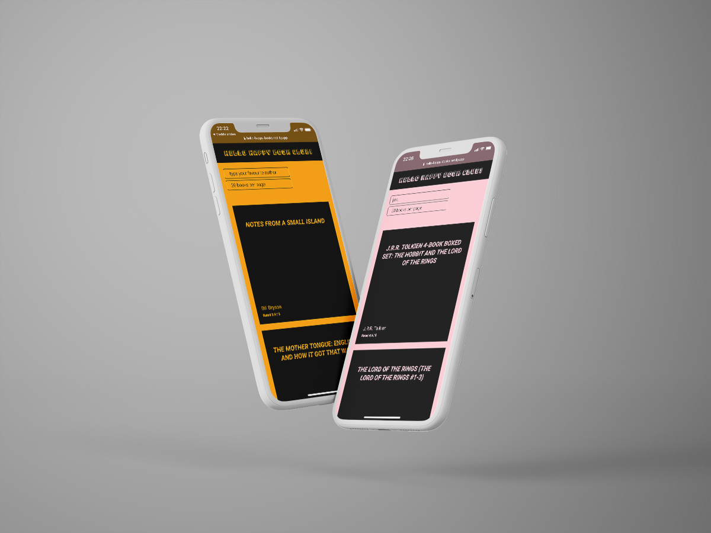

# Express API Project&ensp;|&ensp;[View Live &#10132;](https://books-express.herokuapp.com)

API backend built with Node.js and Express.js. Data from a JSON-file and different routes and queries to sort and filter. Frontend built with React and Sass.

## Core Tech

- Node.js
- Express
- JavaScript
- Heroku

## View it live

- [Backend](https://books-express.herokuapp.com)

- [Frontend GitHub](https://github.com/jonnaru/books-frontend)
- [Frontend live website](https://hello-happy-books.netlify.app/)
